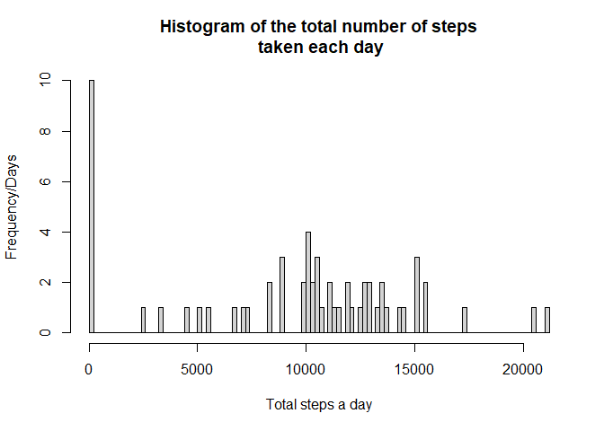
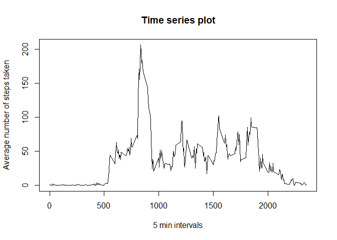
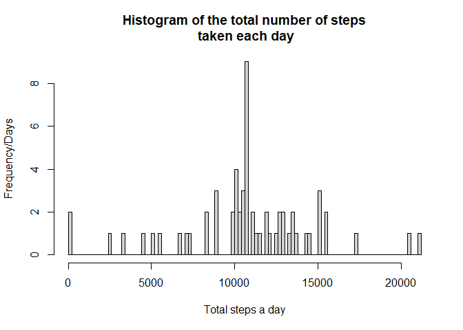
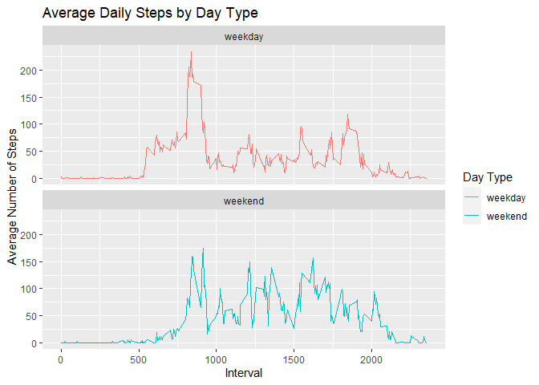

## Analysing fitness tracker data

This is an R Markdown document. Markdown is a simple formatting syntax
for authoring HTML, PDF, and MS Word documents. For more details on
using R Markdown see <http://rmarkdown.rstudio.com>.

## Load in libraries

    library(knitr)

    ## Warning: package 'knitr' was built under R version 4.2.3

    library(dplyr)

    ## Warning: package 'dplyr' was built under R version 4.2.3

    ## 
    ## Attaching package: 'dplyr'

    ## The following objects are masked from 'package:stats':
    ## 
    ##     filter, lag

    ## The following objects are masked from 'package:base':
    ## 
    ##     intersect, setdiff, setequal, union

    library(tibble)

    ## Warning: package 'tibble' was built under R version 4.2.3

## 1. Code for reading in the dataset and/or processing the data

    if(!file.exists("./activity.csv")){
      
    download.file(url="https://d396qusza40orc.cloudfront.net/repdata%2Fdata%2Factivity.zip",
                  destfile = "./cp.zip",method = "curl" )
     unzip(zipfile = "./cp.zip")
     file.remove("cp.zip")
    }

    ## [1] TRUE

    d <- read.csv(file = "activity.csv")
    head(d)

    ##   steps       date interval
    ## 1    NA 2012-10-01        0
    ## 2    NA 2012-10-01        5
    ## 3    NA 2012-10-01       10
    ## 4    NA 2012-10-01       15
    ## 5    NA 2012-10-01       20
    ## 6    NA 2012-10-01       25

## 2. Histogram of the total number of steps taken each day

    total_steps <- as_tibble(d) %>% group_by(date) %>% dplyr::summarise(total_steps = sum(steps, na.rm=T)) 

    hist(total_steps$total_steps, breaks = 100, main="Histogram of the total number of steps\n taken each day", xlab="Total steps a day", ylab="Frequency/Days")

## 3. Mean and median number of steps taken each day

    mean_steps <- mean(total_steps$total_steps)
    print(paste0("The mean of the total number of steps taken per day is ", round(mean_steps,digits = 2) ))

    ## [1] "The mean of the total number of steps taken per day is 9354.23"

    median_steps <- median(total_steps$total_steps)
    print(paste0("The median of the total number of steps taken per day is ", median_steps ))

    ## [1] "The median of the total number of steps taken per day is 10395"

## 4. Time series plot of the average number of steps taken

    ave_steps_interval <- d %>% group_by(interval) %>% summarise(iv_mean = mean(steps, na.rm = T))
    plot(ave_steps_interval$interval, ave_steps_interval$iv_mean, t="l", main="Time series plot",
         xlab="5 min intervals", ylab="Average number of steps taken")

## 5. The 5-minute interval that, on average, contains the maximum number of steps

    max_iv = ave_steps_interval[ave_steps_interval$iv_mean == max(ave_steps_interval$iv_mean),] 
    print( paste0( "The 5-minute interval that, on average, contains the maximum number of steps (",round(max_iv$iv_mean, digits = 2) ,") : ", as.character(max_iv$interval)))

    ## [1] "The 5-minute interval that, on average, contains the maximum number of steps (206.17) : 835"

## 6. Code to describe and show a strategy for imputing missing data

> 6.1 Calculate and report the total number of missing values in the
> dataset (i.e. the total number of rows with NAs)

     sum(is.na(d$steps))

    ## [1] 2304

> 6.2 Devise a strategy for filling in all of the missing values in the
> dataset. The strategy does not need to be sophisticated. For example,
> you could use the mean/median for that day, or the mean for that
> 5-minute interval, etc.

> > We will choose to fill up the missing data with the mean for the
> > given 5 min interval

> 6.3 Create a new dataset that is equal to the original dataset but
> with the missing data filled in

    imputed_steps <- ave_steps_interval$iv_mean[match(d$interval, ave_steps_interval$interval)]

    d_imp <- transform(d,  steps = ifelse(is.na(d$steps), yes = imputed_steps, no = d$steps))

> 6.4 (7) Make a histogram of the total number of steps taken each day
> and Calculate and report the mean and median total number of steps
> taken per day. Do these values differ from the estimates from the
> first part of the assignment? What is the impact of imputing missing
> data on the estimates of the total daily number of steps?

    imp_total_daily <- d_imp %>% group_by(date) %>% summarise(total_steps = sum(steps))

    hist(imp_total_daily$total_steps, breaks = 100, main="Histogram of the total number of steps\n taken each day", xlab="Total steps a day", ylab="Frequency/Days")

    # mean of steps taken a day
    mean(imp_total_daily$total_steps)

    ## [1] 10766.19

    # median of steps taken a day
    median(imp_total_daily$total_steps)

    ## [1] 10766.19

    # the mean and median daily steps are equal in the imputed dataset, and higher than the original one

## 8. Panel plot comparing the average number of steps taken per 5-minute interval across weekdays and weekends

    library(lubridate)

    ## Warning: package 'lubridate' was built under R version 4.2.3

    ## 
    ## Attaching package: 'lubridate'

    ## The following objects are masked from 'package:base':
    ## 
    ##     date, intersect, setdiff, union

    Sys.setlocale("LC_ALL", "en_US")

    ## Warning in Sys.setlocale("LC_ALL", "en_US"): using locale code page other than
    ## 65001 ("UTF-8") may cause problems

    ## [1] "LC_COLLATE=en_US;LC_CTYPE=en_US;LC_MONETARY=en_US;LC_NUMERIC=C;LC_TIME=en_US"

    # Function that categorizes the day names into weekday/weekend

    daytype <- function(day){
      if(day %in% c("Sunday", "Saturday")){
        return("weekend")
      }else{
        return("weekday")
      }
    }

    # categorization of days
    d$day <- as.character(lapply(X = weekdays(as.Date(d$date,format="%Y-%m-%d")),daytype))

    # average step intervals by weekday/weekend category
    weekday_ave_steps_interval <- d[d$day == "weekday",] %>% group_by(interval) %>% summarise(iv_mean = mean(steps, na.rm = T))

    weekend_ave_steps_interval <- d[d$day == "weekend",] %>% group_by(interval) %>% summarise(iv_mean = mean(steps, na.rm = T))

    # creating the plot

    mean_daytype_steps <-  aggregate(steps ~ interval + day, d, mean, na.rm = TRUE)

    library(ggplot2)
    Plot <-  ggplot(mean_daytype_steps, aes(x = interval , y = steps, color = day)) + 
      geom_line() + ggtitle("Average Daily Steps by Day Type") + 
      xlab("Interval") + 
      ylab("Average Number of Steps") +
      facet_wrap(~day, ncol = 1, nrow=2) +
      scale_color_discrete(name = "Day Type")

    print(Plot) 

    # The plot indicates that one is much active in the morning on weekdays, and stays active around the day on weekends
